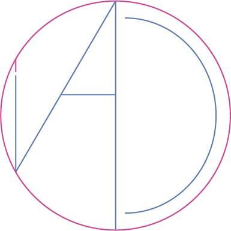

---
<h1> Ciao</h1>
---

Sono Rosa Astarita, un’appassionata di graphic design con una curiosità infinita per tutto ciò che riguarda il mondo della creatività visiva. Ho creato questo spazio per condividere con te ispirazioni, idee e riflessioni su un settore che ammiro profondamente. 
Non importa se sei un professionista o un curioso che muove i primi passi: il mio obiettivo è accompagnarti in questo viaggio con semplicità e un pizzico di entusiasmo. 
Credo che il graphic design non sia solo estetica, ma anche un potente strumento per raccontare storie, trasmettere emozioni e connettere le persone.  Questo blog è il mio modo per esplorare e condividere questo mondo con te, con un tono amichevole e diretto, come se ci conoscessimo da sempre. 
Spero che questo spazio possa ispirarti e aiutarti a scoprire qualcosa di nuovo.  
Grazie per essere qui. Non vedo l’ora di condividere con te questa passione!
